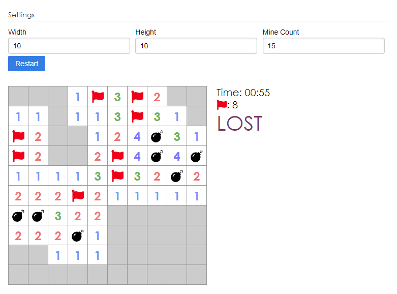

## Mines-React
A clone of minesweeper, built using just React.JS

## Dependencies
React.js, Node.js

## Usage

Use npm to retrieve the react dependencies.

```
$ npm install
```

Run the server using npm state

```
$ npm start
```

You can modify the settings of the game: board width, board height, and the total mine count of the board. When you press restart, the game will use the current setting values and rebuild the board accordingly. 
